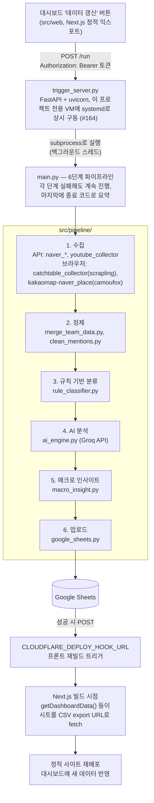
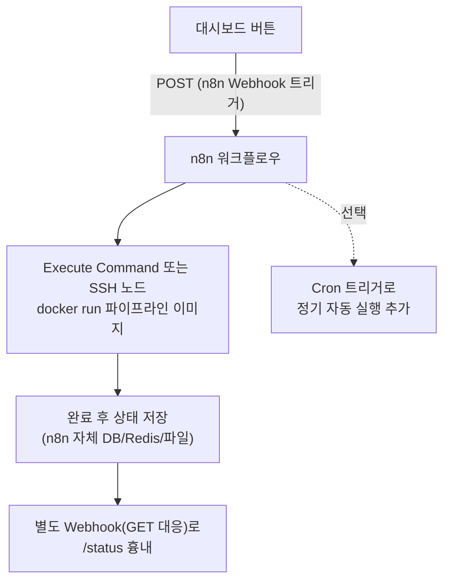

# 멘토님 회사 시스템 이관 대비 설계 문서

> 2026-08-19 기준. 프로젝트 종료 후 이 파이프라인/대시보드를 멘토님 회사의 자체 인프라(n8n 보유, 사내 시스템 Docker 운영)로 이관할 가능성에 대비해 미리 설계를 정리해 둔 문서입니다.
> **이 문서는 설계·체크리스트만 담고 있으며, 실제 Dockerfile/n8n 워크플로우 등 구현물은 포함하지 않습니다.** (#174 범위 — 구현은 멘토님과 실행 방식 합의 후 별도 이슈로 진행)

---

## 1. 현재 아키텍처

**핵심 설계 포인트:** Google Sheets가 파이프라인 ↔ 프론트엔드 사이의 느슨하게 결합된 인터페이스입니다. 프론트는 빌드 시점에 시트를 직접 읽을 뿐, 파이프라인이 어디서 어떻게 도는지 전혀 모릅니다. 이 덕분에 **파이프라인 실행 위치를 바꿔도(이 VM → 멘토님 회사 Docker/n8n) 프론트 코드나 Google Sheet 스키마는 건드릴 필요가 없습니다.** 이관 범위는 사실상 "트리거 서버 + 파이프라인 실행 환경"으로 좁힐 수 있습니다.

프론트엔드가 아는 트리거 계약(`lib/pipelineTrigger.ts`, #164에서 확정)은 다음과 같습니다 — 이관 후에도 이 계약만 지키면 프론트 코드 변경이 필요 없습니다.

| 엔드포인트 | 메서드 | 인증 | 응답 |
|---|---|---|---|
| `/run` | POST | `Authorization: Bearer <token>` | `{ status: "running" }` 등 |
| `/status` | GET | 동일 | `{ status: "idle"\|"running"\|"success"\|"failed", startedAt, finishedAt, failedSteps? }` |

현재 스케줄링은 **수동 버튼뿐**이며 cron 등 정기 자동 실행은 없습니다(#152에서 1단계 범위로 의도적으로 제외, 2단계 과제로 남김).

---

## 2. 이관 시 까다로운 지점

1. **헤드리스 브라우저 의존성** — `camoufox[geoip]`(카카오맵/네이버플레이스), `scrapling[fetchers]`(캐치테이블)는 실제 브라우저 바이너리 + 시스템 라이브러리(폰트, 각종 `.so` 등)가 필요합니다. 반대로 `naver_*`, `youtube_collector`는 순수 `requests` 기반 API 호출이라 Docker화가 단순합니다.
   > ✅ **검증 완료 (2026-08-19, #178)** — 이 VM(aarch64)에서 `python:3.10-slim` 베이스(Playwright 공식 이미지 아님) + apt 시스템 라이브러리 직접 명시 + `camoufox fetch` + `playwright install --with-deps chromium` 조합으로 실제 Docker 컨테이너 안에서 camoufox·scrapling 둘 다 정상 실행/응답 확인함 (PASS). 이론적 리스크가 아니라 **실제로 되는 것으로 확인**됐습니다. 최종 이미지 크기는 약 3.27GB (두 브라우저 엔진 모두 포함 시). 상세 재현 절차·apt 패키지 목록·주의사항(`/dev/shm` 크기 등)은 `docs/spikes/docker-camoufox-scrapling/README.md` 참고.
2. **크레덴셜 소유권** (개인 키 사용 불가, 멘토님 회사 명의로 신규 발급 필수) — `service_account.json`(Google), `NAVER_ID/SECRET`, `YOUTUBE_API_KEY`, `GROQ_API_KEY`, `PIPELINE_TRIGGER_TOKEN`을 그대로 이관할지, 멘토님 회사 계정으로 새로 발급할지에 따라 준비물이 달라집니다. 특히 Google Sheet의 소유권이 바뀌면 서비스 계정 자체를 새로 만들어야 합니다.
3. **트리거 계약 유지** — §1의 `/run`·`/status` 계약을 그대로 흉내 내면 프론트 코드 변경 없이 백엔드만 교체 가능합니다. 계약을 바꾸려면 `src/web/lib/pipelineTrigger.ts`도 같이 고쳐야 합니다.
4. **`main.py`가 스크립트 파일 경로 기준으로 동작** — `PIPELINE_DIR`, `PROJECT_ROOT`를 `Path(__file__)` 기준 상대 경로로 계산하고, 결과물을 `data/raw`, `data/clean`에 로컬 파일로 씁니다. 컨테이너 안에서 그대로 도는 데는 문제없지만, 컨테이너 재시작 시 중간 산출물이 날아가도 되는지(현재는 매 실행 처음부터 다시 수집하므로 문제없음) 확인은 필요합니다.
5. **데이터 수집 규칙(RULES.md §2.1/§2.2) 재확인 필요** — 멘토님 회사 인프라로 옮긴다고 해도 협찬 배제·개인정보 마스킹 등 규칙은 그대로 적용되어야 합니다. 실행 주체가 바뀌는 것이지 수집 정책이 자동으로 바뀌는 게 아니라는 점을 멘토님께도 명시하는 게 좋습니다.
6. **스케줄링 유무** — 지금은 수동 버튼뿐이지만, n8n으로 옮기면 Cron 트리거를 자연스럽게 추가할 수 있습니다. 정기 실행을 원하시는지는 별도 확인이 필요합니다(§5 질문 목록 참고).
7. **`GOOGLE_MAPS_API_KEY` 재발급 시 "레거시 Places API" 활성화 필수** (2026-08-20 검증)
   - GCP 콘솔의 API 라이브러리 목록에는 **"Places API (New)"**만 눈에 잘 띄게 노출되고, 이 프로젝트가 실제로 호출하는 **레거시 "Places API"**(`google_map_collector.py`의 `maps.googleapis.com/maps/api/place/...` 엔드포인트, 서비스명 `places-backend.googleapis.com`)는 콘솔 UI에서 숨겨져 있는 경우가 있습니다. New API로 키를 발급하면 요청 형식이 완전히 달라 코드 수정 없이는 작동하지 않습니다.
   - 활성화 방법: 콘솔에서 직접 `console.cloud.google.com/apis/library/places-backend.googleapis.com` URL로 접속하거나, `gcloud services enable places-backend.googleapis.com --project=<PROJECT_ID>` 명령으로 활성화(둘 다 동작 확인함). 결제(Billing) 계정 연결이 되어 있어야 함.
   - **매장명이 Google Maps 등록명과 다를 수 있음**: 이번 검증 중 "본점"이 Google Maps에는 브랜드명 없이 옛 상호명 "형제국밥"으로 등록되어 있고, 일부 지점은 "○○점"이 아니라 "○○"로만 등록되어 있어 `Text Search` 쿼리가 정확히 일치하지 않으면 결과가 안 나오는 사례를 확인했습니다(`google_map_collector.py`의 `BRANCHES` 상수에 실제 등록명 기준으로 이미 반영해둠). 사장님 쪽에서 매장명을 바꾸거나 신규 지점을 추가하면, 재이관 시 Google Maps 실제 등록명을 다시 대조해 `BRANCHES`를 갱신해야 합니다.

---

## 3. 이관 옵션 비교

### 옵션 A — 기존 `trigger_server.py` 유지 + Docker화

- Python 파이프라인 + FastAPI 트리거 서버를 통째로 하나의 이미지로 패키징. `docker run -d -p 8080:8080 --env-file .env <image>` 정도로 구동.
- 장점: 코드 변경이 거의 없음(경로/환경변수 로딩 방식 그대로), 지금 검증된 동작을 그대로 옮기는 것이라 리스크가 낮음. n8n을 몰라도 운영 가능.
- 단점: n8n의 스케줄링·모니터링·재시도 기능을 활용하지 못함. FastAPI 서버를 상시 구동 상태로 유지해야 함(컨테이너 재시작 정책 필요). 멘토님 회사가 "왜 n8n이 있는데 별도 서버를 또 띄우나"라고 물을 수 있음.
- 적합한 경우: 최대한 빨리, 최소 변경으로 이관하고 싶을 때. 또는 n8n에 Execute Command/SSH로 임의 프로세스를 실행하는 게 회사 정책상 부담스러울 때.

### 옵션 B — n8n 오케스트레이션으로 전환 (`trigger_server.py` 대체)

- 파이프라인 실행 로직 자체(collect/clean/analyze/upload)는 여전히 Docker 이미지로 패키징하되, **그 이미지를 트리거하고 상태를 추적하는 역할**을 FastAPI 대신 n8n이 맡습니다.
- 장점: 스케줄링(Cron 트리거), 실행 이력/로그, 실패 시 알림(Slack/이메일 등) 노드를 n8n UI에서 바로 붙일 수 있음. 별도 상시 서버(uvicorn) 관리 부담이 줄어듦. 멘토님 회사가 이미 익숙한 도구라 운영 인수인계가 쉬움.
- 단점: n8n의 `GET /status` 폴링 흉내가 FastAPI만큼 자연스럽지 않음(n8n Webhook은 기본적으로 요청-응답 1회성 workflow에 최적화되어 있어, "실행 중" 상태를 별도로 유지하려면 n8n 워크플로우 안에 작은 상태 저장소—파일/Redis/DB 등—를 추가로 설계해야 함). 초기 워크플로우 설계에 시간이 좀 더 듦.
- 적합한 경우: 장기적으로 멘토님 회사가 이 파이프라인을 직접 유지보수할 계획이고, 정기 자동 갱신(2단계 과제)도 함께 원할 때.

### 비교 요약

| 항목 | 옵션 A (트리거 서버 유지) | 옵션 B (n8n 오케스트레이션) |
|---|---|---|
| 코드 변경 범위 | 거의 없음(Dockerfile만 추가) | trigger_server.py 로직을 n8n 워크플로우로 재구현 |
| 프론트 코드 변경 | 불필요 (계약 그대로) | 불필요 (계약을 n8n Webhook이 흉내내면 됨) |
| 정기 자동 실행 | 별도 cron 추가 필요 | n8n Cron 트리거로 손쉽게 추가 |
| 상시 프로세스 관리 부담 | 있음 (uvicorn 컨테이너 계속 구동) | n8n이 이미 상시 구동 중이라면 추가 부담 적음 |
| 운영 편의(멘토님 회사 관점) | n8n 안 씀 → 별도 학습 불요, 대신 낯선 FastAPI 서버 하나 더 생김 | n8n 하나로 통합 운영 가능 |
| 초기 구현 공수 | 낮음 | 중간 (상태 추적 설계 필요) |

**참고 제안:** 지금 단계에서 결정할 필요는 없지만(요청대로 보류), 감으로는 — 멘토님 회사가 n8n을 이미 운영 중이고 장기 유지보수를 맡으실 거라면 **옵션 B가 장기적으로 더 자연스러운 선택**입니다. 다만 "빠른 이관"이 우선순위라면 **옵션 A로 먼저 옮기고, 이후 여유 될 때 n8n으로 재편(옵션 B)**하는 단계적 접근도 가능합니다 — Google Sheets 인터페이스 덕분에 두 옵션 사이를 나중에 갈아타도 프론트/데이터 스키마에는 영향이 없습니다.

---

## 4. 크레덴셜/환경변수 체크리스트 (값 이관 방식은 미결정 — 이름만 정리)

`.env.example` / `src/.env.example` 기준. 실제 값은 이 문서에 적지 않습니다.

| 변수 | 용도 | 비고 |
|---|---|---|
| `GOOGLE_CREDENTIALS_PATH` | Google 서비스 계정 JSON 파일 경로 | 파일 자체(`service_account.json`)도 별도 이관 필요 |
| `GOOGLE_SHEET_URL` / `GOOGLE_SHEET_ID` | 결과 업로드 대상 시트 | 멘토님 회사의 구글 계정으로 서비스 계정 신규 발급 필수 |
| `NAVER_ID` / `NAVER_SECRET` | 네이버 검색 오픈 API | 앱 등록 계정 이관 또는 재발급 검토 |
| `YOUTUBE_API_KEY` | YouTube Data API v3 | GCP 프로젝트 이관 또는 재발급 검토 |
| `GROQ_API_KEY` | AI 분석(ai_engine.py) | 이슈 #156에서 antigravity→Groq 전환. 무료 발급 가능(console.groq.com) |
| `GROQ_MODEL` / `GROQ_REASONING_EFFORT` | (선택) Groq 모델/추론 옵션 override | 비워두면 코드 기본값 사용 |
| `PIPELINE_TRIGGER_TOKEN` | 트리거 서버(백엔드) 인증 토큰 | 프론트의 `NEXT_PUBLIC_PIPELINE_TRIGGER_TOKEN`과 반드시 일치해야 함 |
| `NEXT_PUBLIC_PIPELINE_TRIGGER_URL` / `NEXT_PUBLIC_PIPELINE_TRIGGER_TOKEN` | 프론트가 호출할 트리거 서버 주소/토큰 | 빌드 시점에 JS 번들에 그대로 박힘 — 완전한 비밀로 취급 불가(스팸성 재실행 방지용 최소 장치 수준) |
| `CLOUDFLARE_DEPLOY_HOOK_URL` | 파이프라인 성공 시 프론트 재빌드 훅 | 프론트를 계속 Cloudflare에 둘지, 멘토님 회사 인프라(Docker+nginx 등)로 옮길지에 따라 값/유무가 달라짐 |
| `KAKAO_REST_API_KEY` | (현재 미사용 추정 — `src/.env.example`에만 존재, 실제 코드에서 `KAKAO_REST_API_KEY` 참조 여부는 재확인 필요) | 이관 전 코드 재확인 권장 |
| `GOOGLE_MAPS_API_KEY` | 구글맵 리뷰 수집(Places API, 지점당 최대 5개) | 현재 채택된 경로. 재발급 여부는 다른 Google 키와 동일한 흐름. **재발급 시 주의사항은 §2.7 참고(레거시 Places API 활성화 필요, "Places API (New)" 아님)** |
| `GOOGLE_MAPS_REVIEW_PROVIDER` / `GOOGLE_BUSINESS_PROFILE_*` | (선택, 핸드오프 후 사용) Business Profile API로 전환 시 전체 리뷰 수집 | 사장님/회사 명의 계정이 각 지점 Business Profile Owner/Manager로 등록 + OAuth 승인 필요. 코드 스위치는 이미 준비됨(`google_map_collector.py`) — §5 질문 8 참고 |

---

## 5. 멘토님께 확인이 필요한 질문 목록

1. 파이프라인 실행을 **n8n이 오케스트레이션**(옵션 B)하길 원하시는지, 아니면 **별도 컨테이너가 자체 서버로 상시 구동**(옵션 A)하는 편이 회사 인프라 정책상 더 편하신지?
2. n8n에서 임의의 셸 명령/Docker 명령을 실행하는 노드(Execute Command, SSH, Docker 등)를 쓰는 게 회사 보안 정책상 허용되는지? (일부 회사는 n8n의 코드 실행 노드를 제한함)
3. Google Sheets를 계속 데이터 인터페이스로 써도 되는지, 아니면 회사 내부 DB(예: PostgreSQL, 사내 데이터 플랫폼)로 바꾸길 원하시는지? — 바뀌면 `google_sheets.py`(업로드)와 `src/web/lib/googleSheets.ts`(조회) 양쪽 다 손봐야 함
4. Google 서비스 계정/API 키(네이버·유튜브·Groq)를 회사 명의로 새로 발급받을 계획인지, 아니면 기존 계정을 그대로 넘겨받을 계획인지?
5. 프론트엔드(대시보드)도 사내 인프라로 옮기길 원하시는지(예: 사내 nginx/Docker로 정적 파일 서빙), 아니면 Cloudflare에 계속 두고 트리거 서버/파이프라인만 이관하길 원하시는지?
6. 정기 자동 갱신(cron 스케줄)을 이번 이관과 함께 원하시는지, 아니면 지금처럼 수동 버튼만으로 충분한지? (원하시면 n8n Cron 트리거로 자연스럽게 추가 가능 — 옵션 B 선택에 영향)
7. camoufox/scrapling 같은 헤드리스 브라우저 기반 수집기(카카오맵·캐치테이블)를 회사 Docker 환경에서 그대로 돌려도 되는지, 아니면 이 채널들은 이관 범위에서 제외하고 API 기반 수집기(네이버·유튜브)만 우선 이관할지? (실제 검증 결과 이미지 크기 약 3.27GB — §2 참고. 기술적으로는 되지만, 이 용량이 회사 인프라 정책상 부담인지는 확인 필요)
8. 구글맵 리뷰를 지점당 5개 샘플이 아니라 **전체** 리뷰로 받고 싶으신지? 원하시면 사장님(또는 회사) 명의 Google 계정을 각 지점 Business Profile의 Owner/Manager로 등록하고 Business Profile API OAuth 승인을 받아야 합니다(비용은 없지만 사장님 쪽 계정 작업 필요). 코드 전환 지점은 이미 준비돼 있습니다(`docs/collection-pipeline-feasibility.md` "D" 절, `google_map_collector.py`의 `get_reviews_via_business_profile()`).

---

## 6. 권장 다음 단계

1. ~~로컬/스테이징에서 Docker 빌드·실행 검증 (camoufox/scrapling 브라우저 의존성)~~ — **완료 (#178, 2026-08-19)**. `docs/spikes/docker-camoufox-scrapling/` 참고
2. 위 §5 질문을 멘토님과 논의해 옵션 A/B 및 크레덴셜 방식을 확정
3. 확정된 방향에 맞춰 실제 프로덕션 Dockerfile(전체 `src/pipeline/requirements.txt` + `main.py`/`trigger_server.py` 포함, 필요 시 n8n 워크플로우 JSON export)을 작성하는 후속 이슈 생성 — 스파이크의 apt 패키지 목록/빌드 순서를 그대로 재사용 가능
4. 크레덴셜 이관 체크리스트(§4)에 따라 실제 값 전달 — 이 저장소나 채팅에 평문으로 남기지 않고 별도 보안 채널(1Password, 회사 시크릿 매니저 등) 사용 권장
